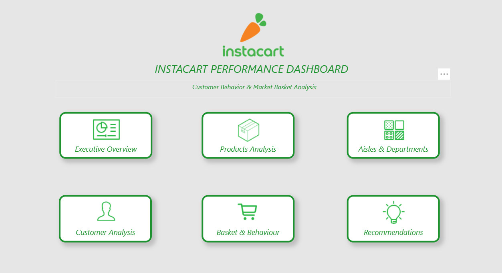
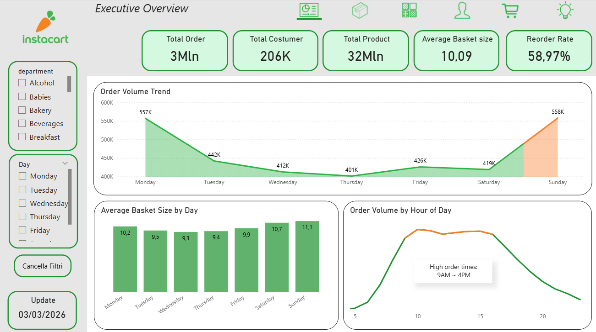
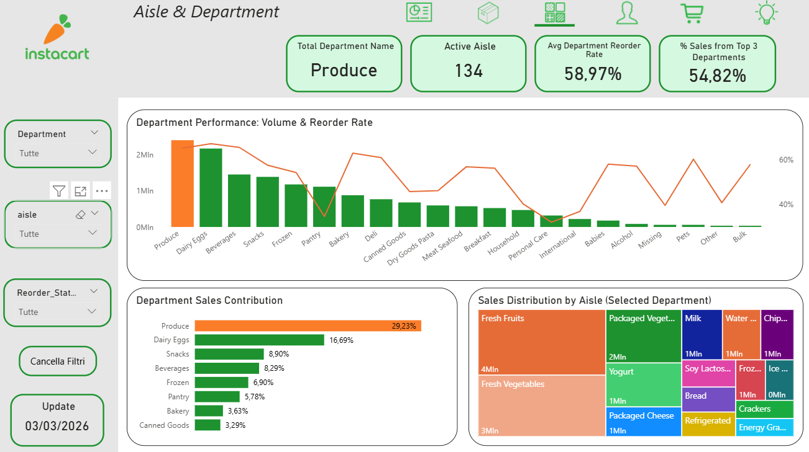
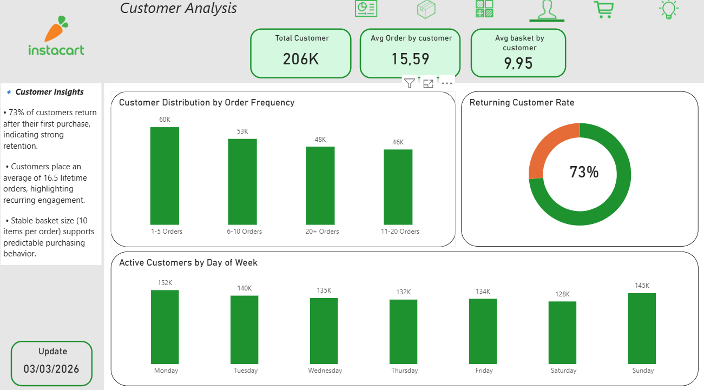
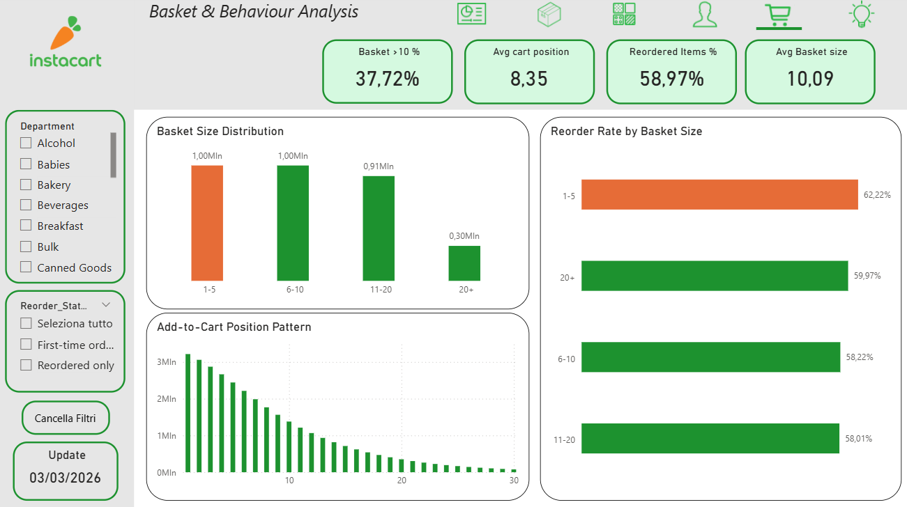
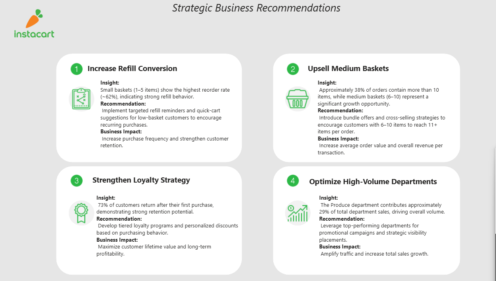

# 🛒 Instacart Data & Business Intelligence Analysis

---

## 📌 Project Overview

End-to-end analysis of Instacart transactional data aimed at understanding customer behavior, product performance, and department contribution to overall sales.

The project combines data cleaning in Python with interactive dashboard development in Power BI.

---

## 🏠 Dashboard Home

Main navigation page providing structured access to all analytical sections and simulating a business-ready dashboard experience.

---

## 🎯 Business Objectives

- Analyze order trends and peak purchasing times  
- Identify top-performing products and reorder behavior  
- Evaluate department sales contribution  
- Understand customer retention and basket patterns  

---

## 🧹 Data Cleaning

Data preparation was performed using Python (Pandas), including:

- Handling missing values  
- Removing duplicates  
- Data type corrections  
- Validation checks  

Notebook available in:

`01_data_cleaning.ipynb`

---

## 📊 Dashboard Structure

### 1️⃣ Executive Overview

---

### 2️⃣ Product Analysis

---

### 3️⃣ Department Analysis

---

### 4️⃣ Customer Analysis

---

### 5️⃣ Basket & Behaviour Analysis

---

### 6️⃣ Recommendations

---

## 💡 Key Insights

- 73% returning customer rate indicates strong retention  
- Produce department contributes ~29% of total sales  
- Peak order time: 9AM–4PM  
- Smaller baskets show slightly higher reorder consistency  

---

## 🛠 Tools Used

- Python (Pandas, NumPy)  
- Power BI  
- DAX  

---

## 📈 Professional Value Demonstrated

- End-to-end data cleaning workflow  
- KPI-driven dashboard development  
- Business insight generation  
- Translation of data into strategic recommendations  

---

## 📎 Note

The Power BI (.pbix) file is not uploaded due to GitHub size limitations.  
Dashboard previews and insights are provided above.
